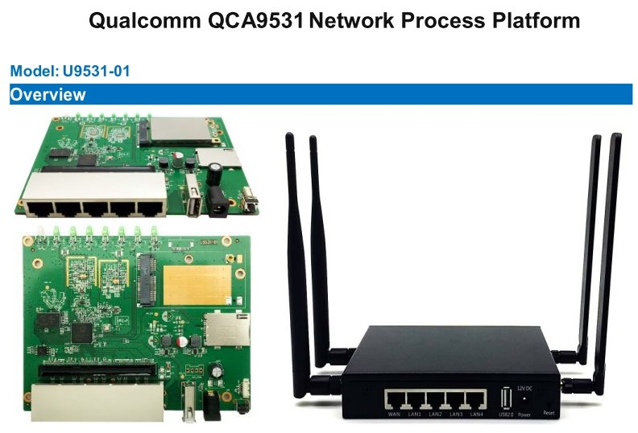
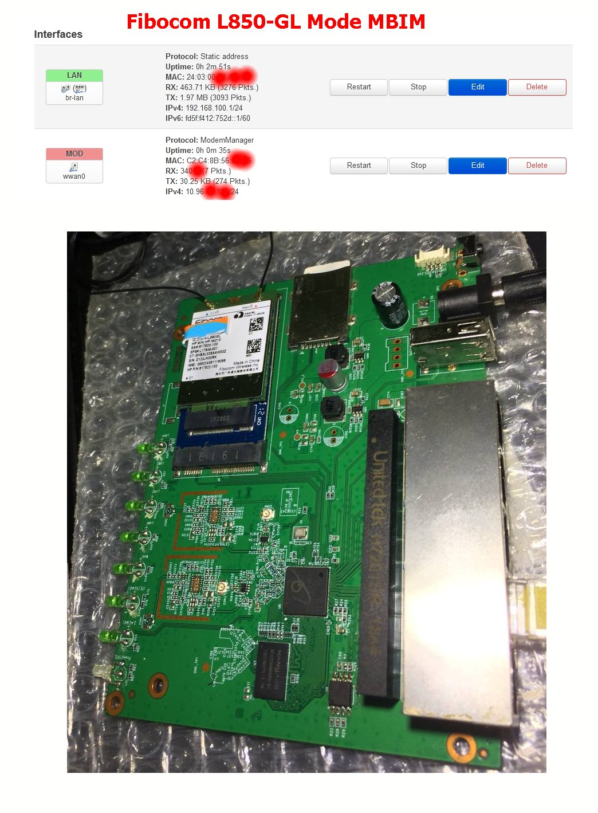
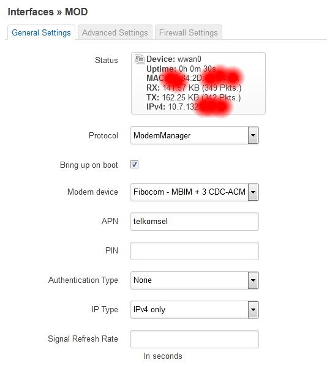

# Openwrt-U9531
Openwrt U9531-01 - Unielec

detail : http://www.unielecinc.com/q/news/cn/p/product/detail.html?qd_guid=EENzXiDhJT

openwrt router dengan bawaan Chaos Chalmer 15
kalau gak salah ingat, soalnya gak sempat backup versi bawaan

ceritanya beli router ini karena tertarik dengan internal PCIE 
rencana akan dipasangkan Fibocom L850-GL atau LT4220
karena masoh versi 15 pengen update ke yang lebih tinggi
tapi ternyata gak nemu standar U9531

setelah googling nemu versi yang cocok yaitu
openwrt-18.06.9-ar71xx-generic-ap147-010-squashfs-sysupgrade.bin

versi yang saya terima masih uboot standar
makanya ketika coba cari FW yang cocok sempat brick

uboot breed yang cocok untuk versi ini adalah yang breed-qca953x-letv-lba-047-ch.bin

setelah ujicoba sekian banyak FW ketemu 2 versi yang cocok
openwrt-18.06.9-ar71xx-generic-ap147-010
openwrt-19.07.10-ar71xx-generic-tl-wr842n-v3

semua file sudah saya upload
saat ini saya gunakan openwrt-19.07.10-ar71xx-generic-tl-wr842n-v3 dengan modem Fibocom L850-GL
hasilnya lumayan bagus 

instalasi modemnya menggunakan modemmanager  
dengan rujukan dari  
https://radenku.com/cara-setting-modemmanager-di-openwrt/

